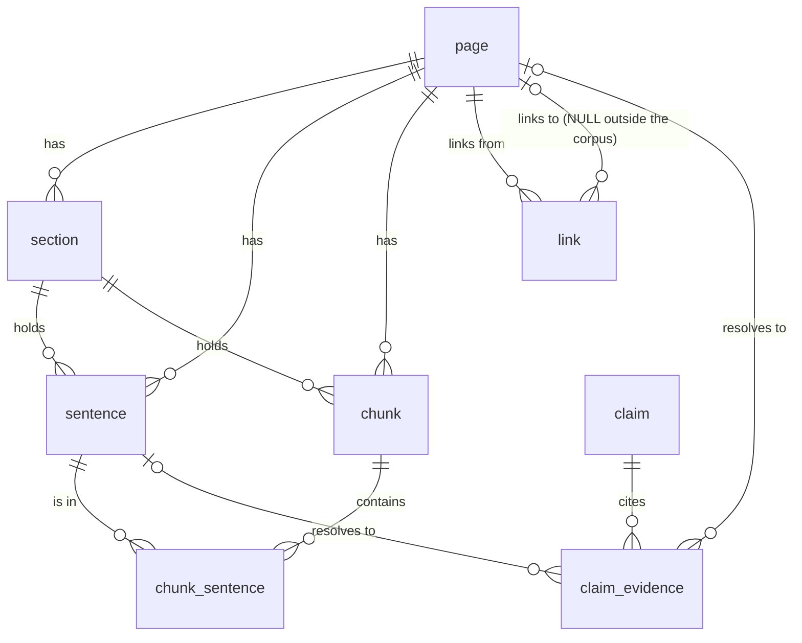

# How WikiLense is built

A guide to the code for someone new to vector search and to MariaDB's internals. It follows
the data from the downloaded files to a search result and a recall number, then goes through
every file. Two other documents go deeper: [DESIGN.md](DESIGN.md) is the contract between the
modules and records every decision and measurement, and the [README](../README.md) presents the
results. Numbers in this guide were measured on the committed corpus on 2026-09-23 unless a
file under `results/` is named.

## 1. What WikiLense does

WikiLense answers a question by finding the passages of Wikipedia that mean the same thing,
not just the ones that share its words. It does this entirely inside MariaDB 11.8. Every
Wikipedia page of the corpus (100 pages) is cut into passages called chunks, each chunk is
turned into a list of 384 numbers that describes its meaning, and those numbers are stored in a
MariaDB table next to the page's title, sections and links. A query is turned into numbers the
same way, and one SQL statement returns the chunks whose numbers are closest. For example,
`wikilense query "Aare river in Switzerland" --k 3` returns the lead of the page *Aare*
(distance 0.0939) and two chunks of its *Course* section (0.1688 and 0.1919). Because the chunks
live in ordinary tables, the same statement can also say "only sections headed *History*" or
"only pages that *Aare* links to". The queries used to measure how well this works are
fact-checking claims from the FEVEROUS dataset, whose annotators marked the sentences that prove
or refute each claim.

## 2. The pipeline at a glance

```mermaid
flowchart TD
    F["data/feverous/<br/>FEVEROUS claims (train, dev)<br/>+ Wikipedia shard wiki_000.jsonl<br/>(downloaded, not in git)"]
    B["scripts/build_corpus.py<br/>picks 75 claims and 100 pages"]
    C["data/corpus/<br/>pages.jsonl, claims.jsonl, MANIFEST.md<br/>(committed)"]
    I["wikilense ingest (ingest.py)<br/>parse (wikitext.py) → chunk (chunking.py)<br/>→ embed (embedding.py) → load (db.py)"]
    M[("MariaDB 11.8<br/>page, section, sentence, chunk (VECTOR),<br/>chunk_sentence, link, claim,<br/>claim_evidence, ingest_meta")]
    S["search (search.py)<br/>wikilense query · wikilense serve"]
    E["evaluate (evaluate.py)<br/>wikilense eval · scripts/run_experiments.py"]
    R["results/<br/>JSON + Markdown per run, SUMMARY.md"]
    F --> B --> C --> I --> M
    M --> S
    M --> E --> R
    S -.->|the same search() function| E
```

**FEVEROUS files.** The raw downloads live in `data/feverous/` and are not committed (two files
are over GitHub's 100 MB limit). `scripts/fetch_wiki_shard.py` downloads one Wikipedia shard
(`wiki_000.jsonl`, 9,996 pages) without the 10 GB archive around it.

**Corpus selection.** `scripts/build_corpus.py` keeps the 75 claims whose evidence lies entirely
in that shard, their 54 evidence pages, and 46 "filler" pages that those pages link to (realistic
distractors). It writes `data/corpus/`, which is committed and rebuilt byte for byte by the
script.

**Ingest.** `wikilense ingest` reads `data/corpus/`, splits every page into sections and text
units (sentences and list items), groups consecutive units into chunks of at most 240 words,
embeds each chunk, and writes nine tables. It takes about 26 s on the RTX 4060 (22 s of it
embedding), measured tonight.

**Search.** `search.search()` embeds nothing itself: it takes the query's vector and runs one
statement that ranks chunks by cosine distance, with any filters in the same statement. The CLI
(`wikilense query`) and the web page (`wikilense serve`) are two front ends to it.

**Evaluation.** `evaluate.evaluate()` runs every claim through `search()` and checks the hits
against the claims' gold evidence, which ingest stored in `claim_evidence`. `wikilense eval`
writes one JSON and one Markdown file; `scripts/run_experiments.py` runs the whole set of
experiments into `results/` and builds `results/SUMMARY.md` from them.

## 3. Key ideas for a beginner

**Embedding, vector, cosine distance.** An *embedding model* (here `BAAI/bge-small-en-v1.5`)
reads a text and outputs a *vector*: a list of 384 numbers placed so that texts with similar
meaning get vectors pointing in similar directions. *Cosine distance* is 1 minus the cosine of
the angle between two vectors: 0 for the same direction, larger the more they differ. MariaDB
computes it with `VEC_DISTANCE_COSINE(a, b)`; the chunk vectors are stored in a
`VECTOR(384)` column.

**Chunk, and why at section boundaries.** A *chunk* is the unit that gets one vector: a run of
consecutive sentences, here at most 240 words, overlapping its neighbour by one sentence
(`chunking.chunk_units`). A chunk never crosses a section heading, because a section is one
topic and a vector that mixes two topics matches neither well; it also means every chunk has one
section path (for example `Afghanistan > History`), which the heading filter needs. Navigation
lines such as "Main article: X" (hatnotes) and empty units are left out of chunks.

**HNSW vector index, `M`, `mhnsw_ef_search`.** Comparing the query with all 4,598 chunk vectors
works, but gets slow as the table grows. A *vector index* avoids that. MariaDB's is *HNSW*
(hierarchical navigable small world): a graph in which every vector is linked to a few similar
ones, so a search can hop through the graph towards the query instead of reading every row.
`M` is how many links each vector keeps (16 here, written in `sql/schema.sql`; more links, a
bigger and better graph). `mhnsw_ef_search` is how many candidates a search keeps while hopping
(the application sets 100 per query; the server default is 20); more candidates, closer to the
exact answer, a little slower.

**Exact versus approximate search.** An *exact* search compares the query with every vector and
is always right. An *approximate* search (the HNSW graph) may miss a close vector, in exchange
for speed. On this corpus the difference is measured: with M=16 and `mhnsw_ef_search` 100 the
approximate hit lists equal the exact ones for 74 of 75 claims (`results/SUMMARY.md` section 7).
A surprise documented in DESIGN.md: once another table is joined in the same statement (strategy
`inline`), MariaDB ranks exactly over the index, so filtered queries are exact.

**`EXPLAIN`.** Putting `EXPLAIN` in front of a statement makes MariaDB show its plan instead of
running it: which table it reads first, with which index. When the row for `chunk` says
`type index, key embedding`, the vector index drives the search. `wikilense query --explain`
prints it (section 5), and the tests check it.

**`FULLTEXT` and RRF.** A `FULLTEXT` index finds rows that contain the query's *words*
(`MATCH(text) AGAINST (...)`), the classic keyword search. *Reciprocal rank fusion* (RRF)
combines two ranked lists: each chunk scores `1 / (60 + rank)` in each list it appears in, and
the sums are sorted. Strategy `rrf` fuses the vector ranking with the full-text ranking in one
statement, so a chunk that is only a good keyword match can still be found.

**recall@k; article recall versus evidence recall.** *recall@k* asks: among the first `k` hits,
is what we were looking for there? *Article recall* counts a claim when a gold page (a page the
annotators cited) is among the pages of the top-k chunks. *Evidence recall* is stricter: every
gold sentence of at least one of the claim's evidence sets must be inside the top-k chunks, found
through the `chunk_sentence` map. It is counted over the 66 claims whose evidence is made of
sentences and list items (the other 9 need table cells, which are not indexed). Tonight's check
with the defaults: article recall@10 74 of 75, evidence recall@10 60 of 66.

**Latency p50 and p95.** *Latency* is how long a search takes. Each claim is searched 5 times, and
the times are summarised as *p50* (the median: half the searches were faster) and *p95* (95% were
faster; it shows the slow tail). The SQL time and the time to embed the query are reported
separately. Tonight at k=10: SQL p50 0.47 ms, p95 0.96 ms; query embedding p50 4.52 ms on the GPU.

## 4. File by file

Every tracked file outside `results/` and `data/`. "Reads first" names the one function to read
to understand the file.

### The package `wikilense/`

| File | What it is for | Reads / writes | Calls | Read first |
|---|---|---|---|---|
| `__init__.py` | Package marker and `__version__` (0.1.0), recorded in `ingest_meta` and every result. | - | - | - |
| `config.py` | Every setting as a `WIKILENSE_*` variable, from the environment or `.env`; the defaults (240 words, overlap 1, the model and its pinned revision, `ef_search` 100) and the `ef_search` range 1 to 10000 (0 = the server's value). | reads `.env` | python-dotenv | `load_settings` |
| `corpus.py` | Reading `data/corpus/*.jsonl`, parsing FEVEROUS element ids (`Aare_sentence_0` → page, type, key) and the corpus selection rule. Standard library only. | reads the JSONL files | - | `select_corpus` |
| `wikitext.py` | Parses one FEVEROUS page: walks its `order`, keeps a stack of section headings, emits one `TextUnit` per sentence and list item with cleaned text (`[[target\|shown]]` → `shown`), finds hatnotes and extracts links. | - | - | `parse_page` |
| `chunking.py` | Groups a page's text units into chunks of at most `max_words` words, never across a section, one unit of overlap; `embedding_text` adds the `title > section path:` prefix that is embedded. | - | `config`, `wikitext` | `chunk_units` |
| `embedding.py` | `Embedder`: loads the sentence-transformers model lazily (on the GPU when there is one), pinned to the revision `results/` were measured with; `embed_queries` prepends the BGE query instruction, `embed_passages` does not. | model cache `~/.cache/huggingface` | `config`; sentence-transformers, torch | `Embedder.embed_queries` |
| `db.py` | The MariaDB layer: `connect`, running `sql/schema.sql` (`apply_schema`, with its own SQL splitter), `insert_rows` with an allowlist of table and column names (`SCHEMA_COLUMNS`), `vec_param` (the bytes bound for a `VECTOR`), the one allowed session variable, `EXPLAIN`, and reading the index's M from `SHOW CREATE TABLE`. | the database; reads `sql/schema.sql` | `config`; PyMySQL | `insert_sql` |
| `ingest.py` | The pipeline behind `wikilense ingest`: checks settings and model, then seven steps (schema, pages, chunks with embeddings, link resolution, `ANALYZE TABLE`, claims and evidence, `ingest_meta`), each committed when it completes. | reads `data/corpus/`; writes all nine tables | `db`, `corpus`, `wikitext`, `chunking`, `embedding` | `_Ingest.run` |
| `search.py` | The queries: the four strategies (`inline`, `overfetch`, `none`, `rrf`), the `Filters` (words, heading, path, links, titles), every SQL statement as a named constant or fragment, `ef_search` set per call and restored, and the joins back to sentences and page summaries. | the database (read only) | `db`, `config` | `search_statement` |
| `evaluate.py` | The recall and latency harness: ground truth from `claim_evidence`, the pure metric functions, one untimed and `repeats` timed passes over every claim and k, and the JSON and Markdown writer. | reads the database; writes `<out>/<name>.json/.md` | `db`, `search` | `evaluate` |
| `cli.py` | The `wikilense` command (`init-db`, `ingest`, `query`, `eval`, `serve`), argument checking, one-line errors and the documented exit codes (0, 1, 2, 130), and the text output of `query`. | stdout / stderr | `db`, `ingest`, `search`, `evaluate`, `embedding`, `web` | `cmd_query` |
| `web.py` | A FastAPI app: `GET /` is one self-contained HTML page (its script writes data with `textContent` only), `GET /api/search` returns hits, the SQL, its `EXPLAIN` and timings; one database connection per request; `/docs` is the interactive API page. | the database (read only) | `db`, `search`, `embedding`; FastAPI | `api_search` |

### `sql/`

| File | What it is for |
|---|---|
| `schema.sql` | The data model: nine `CREATE TABLE IF NOT EXISTS` statements with comments, including `embedding VECTOR(384)`, `VECTOR INDEX (embedding) M=16 DISTANCE=cosine` and `FULLTEXT KEY ft_chunk_text (text)`. The only place the schema is defined; `db.apply_schema` runs it, and a test checks it against `db.SCHEMA_COLUMNS` column for column. |
| `examples.sql` | Seven query shapes for the `mariadb` client alone, no Python: the bare index query, predicates and joins, the link filter, over-fetch, the RRF hybrid, the join back to sentences, and the vector as text. The query vector is the stored embedding of chunk 1. |
| `docker-init/01-test-database.sh` | Run once by the MariaDB container when its data volume is created: makes the `<name>_test` database for the test suite and grants it to the application user. |

### `scripts/`

| File | What it is for | Reads / writes | Read first |
|---|---|---|---|
| `fetch_wiki_shard.py` | Downloads one FEVEROUS Wikipedia shard with HTTP range requests (reads the zip's directory at its end, then only that member), checks the CRC and writes it. Standard library only. | writes `data/feverous/wiki_pages/` | `central_directory` |
| `build_corpus.py` | Applies `corpus.select_corpus` to the shard and claim files and writes `data/corpus/` with a manifest of counts and SHA-256 digests. | reads `data/feverous/`; writes `data/corpus/` | `main` |
| `run_experiments.py` | The experiment protocol behind `results/`: groups (`stability`, `ef_search`, `index_m`, `chunk_size`, `prefix`, `filters`, `final`, `restore`, `summary`) that ingest a named configuration, rebuild the index for another M, restart the container, and evaluate; `summary` rebuilds `results/SUMMARY.md` from the JSON files. Root-level SQL goes through `docker exec` with the password in the environment only. | the main database, docker; writes `results/` | `run_eval` |

### `tests/`

| File | What it tests |
|---|---|
| `conftest.py` | Shared fixtures: the settings and a connection to the *test* database (schema reset per test). Skips `db` tests when MariaDB is not reachable and `slow` tests when the model cannot be loaded; refuses a test database that is the main one or does not end in `_test`. |
| `test_wikitext.py`, `test_chunking.py`, `test_corpus.py` | Parsing, markup cleaning, hatnotes, the chunk rules (overlap, section boundaries, word budget), element ids and the selection rule, on small hand-made pages. |
| `test_embedding.py` | The text helpers, laziness, the pinned revision; the real model (`slow`): shape, normalisation, determinism. |
| `test_db.py` | Settings loading, the SQL splitter, the schema file against the code, identifier allowlists, vector bytes; against the server: the round trip of a vector, the index in `EXPLAIN`, session variables, transactions. |
| `test_ingest.py` | A three-page synthetic corpus ingested with a fake embedder: every count, every table, the checks that run before anything is dropped, `--no-reset`, batching. |
| `test_search.py` | Twelve chunks whose distances to the query are known exactly: every strategy with every filter, parameter order, `EXPLAIN`, RRF scores computed by hand, `ef_search` restored even when the statement fails. |
| `test_evaluate.py` | The metrics on hand-made hit lists, and whole evaluations with known rankings (pure, with fakes, and against the test database). |
| `test_cli.py`, `test_web.py` | Every command and the API: options reaching `search()`, output formats, error messages and exit codes, HTTP status codes, escaping. |
| `test_experiments.py`, `test_fetch_wiki_shard.py` | The script parts that need no server: hit-list comparison, configuration check, fixed SQL, the password route to `docker exec`; download error handling. |

### Top-level files

| File | What it is for |
|---|---|
| `README.md` | What the project is, what it found, setup, examples, the data model and the measured results (a draft until the experiments are redone). |
| `CLAUDE.md` | The project's rules and decisions, for Claude Code sessions: the brief, grading, benchmark facts, environment. |
| `LICENSE` | MIT licence. |
| `Makefile` | `make setup` (`.env`, MariaDB, the venv, the ingest), `make test`, `lint`, `eval`, `serve`, `experiments`, `down`; `make -n <target>` prints the commands. |
| `docker-compose.yml` | MariaDB 11.8 in a container named `wikilense-mariadb`, bound to `127.0.0.1:3306`, passwords from `.env`, a 512 MB HNSW cache, the init script mounted, a health check. |
| `.env.example` | The template for `.env`: connection settings and the two passwords to replace; the retrieval settings as comments. `.env` itself is ignored by git. |
| `.gitignore` | Keeps out the venv, caches, `.env` and the raw FEVEROUS downloads. |
| `pyproject.toml` | The package, its dependencies, the `wikilense` command, pytest markers (`db`, `slow`, `--strict-markers`) and ruff settings. |
| `requirements.txt`, `requirements-dev.txt` | The dependency ranges (runtime; plus pytest and ruff). |
| `requirements.lock`, `requirements-cpu.lock` | Exact versions: the GPU build that produced `results/`, and the CPU-only build that CI installs. |
| `.github/workflows/ci.yml` | On every push to `main` and every pull request: MariaDB 11.8 as a service, the CPU lock, the test database, ruff, and the whole test suite with db and slow tests required to run. |
| `docs/DESIGN.md` | The design contract and every measured outcome and deviation. |
| `docs/ARCHITECTURE.md` | This guide. |
| `analysis/feverous/` | An earlier phase: `feverous_analysis.py` measures how many FEVEROUS claims need several pages, writing `feverous_claims.csv`, `feverous_stats.json` and `feverous_analysis_output.md`; `FEVEROUS_ANALYSIS.md` is the report that chose the benchmark. Not used by the package. |

## 5. One query, end to end

The command:

```
wikilense query "When was Kabul founded?" --heading '%History%' --k 3 --explain
```

1. **Parsing.** `cli.main` builds the parser (`build_parser`) and calls `cmd_query`, which reads
   the settings with `config.load_settings()` (from `.env`) and turns the options into
   `search.Filters(heading_like="%History%")` in `_filters_from_args`. `%` is the SQL `LIKE`
   wildcard, so the pattern means "a heading that contains *History*".
2. **`mhnsw_ef_search`.** No `--ef-search` was given, so `search.resolve_ef_search(None, 100)`
   takes the settings' 100.
3. **The database first.** `_connect` opens a connection (`db.connect`), and `_require_chunks`
   runs `SELECT COUNT(*) FROM chunk`, so an empty or missing database fails with one line before
   the model is loaded.
4. **The query vector.** `make_embedder` builds the `Embedder`; `_load_model` embeds a warm-up
   text so the model load (about 5 s) is timed on its own; `_embed_query` calls
   `embed_queries([text])`, which prepends "Represent this sentence for searching relevant
   passages: " and returns 384 numbers, and checks there are 384 of them.
5. **The statement.** `search.search` calls `search_statement`, which validates the arguments
   (`_check_search_args`, where `db.vec_param` turns the vector into 1,536 bytes) and assembles
   the `inline` statement from named fragments (`INLINE_SELECT`, `INLINE_FROM`, the heading
   predicate from `_filter_fragments`, `INLINE_ORDER_LIMIT`). Every value is a `%s` parameter:

   ```sql
   SELECT chunk.chunk_id, chunk.page_id, page.title, section.path AS section_path,
          chunk.ordinal AS chunk_ordinal, chunk.n_words,
          VEC_DISTANCE_COSINE(chunk.embedding, %s) AS distance, chunk.text
   FROM chunk STRAIGHT_JOIN page ON page.page_id = chunk.page_id
              STRAIGHT_JOIN section ON section.section_id = chunk.section_id
   WHERE section.heading LIKE %s
   ORDER BY VEC_DISTANCE_COSINE(chunk.embedding, %s) LIMIT %s
   -- parameters: <vector[384]>, '%History%', <vector[384]>, 3
   ```

   `STRAIGHT_JOIN` makes MariaDB start from `chunk`, so the vector index drives the search.
6. **Running it.** `ef_search_session` reads the session's `mhnsw_ef_search`, sets it to 100
   (`SET SESSION mhnsw_ef_search = %s`), and after the statement puts the old value back in a
   `finally` clause. The rows become `Hit` objects, sorted by distance and then chunk id.
7. **`--explain`.** `search.explain_search` runs `EXPLAIN` on the same statement and parameters:

   ```
   table    type    key        rows  Extra
   chunk    index   embedding  3
   page     eq_ref  PRIMARY    1
   section  eq_ref  PRIMARY    1     Using where
   ```

   `chunk` is read through the vector index; `page` and `section` are looked up by primary key
   (`eq_ref`), and the heading test runs on the section row (`Using where`).
8. **Output.** `format_hits` prints the hits and `format_explain` the SQL and plan on stdout; one
   timing line goes to stderr:

   ```
    1. 0.3105  Afghanistan > History  [chunk_id 928, 192 words]
    2. 0.3472  Afghanistan > History > Prehistory and antiquity  [chunk_id 929, 230 words]
    3. 0.3485  Afghanistan > History > Contemporary history  [chunk_id 943, 231 words]
   3 hits; model load 5134 ms, embedding 5.3 ms, SQL 4.4 ms (BAAI/bge-small-en-v1.5 on cuda,
   strategy inline, ef_search 100)
   ```

   (each hit is followed by its chunk text). Hit 2 shows the pattern at work: the heading is
   *Prehistory and antiquity*, which contains "history", and `section.heading` compares without
   regard to case. 117 of the 4,598 chunks pass the filter.

   Why is the page *Kabul* not among the hits? Its *History* section has no text of its own: the
   text sits in subsections such as *Antiquity* and *20th century*, whose headings do not contain
   "history", so `--heading` never sees them. The section *path* does (`History > Antiquity`):
   `--path 'History%' --title Kabul` returns *Kabul > History > Antiquity* at distance 0.2361,
   closer to the query than any hit above. Choosing between `heading` and `path` is choosing
   between "this section's own heading" and "anywhere under this heading".

## 6. The database

Nine tables, all InnoDB with `utf8mb4` text. The arrows read "one to many".



`ingest_meta` stands alone: key/value pairs recording how the database was ingested (model and
its revision, chunk settings, index M, corpus digests, time).

| Table | Rows now | One row per |
|---|---|---|
| `page` | 100 | Wikipedia page, with its size statistics (`n_words` is indexed for length filters) |
| `section` | 3,173 | section, the lead included; `path` is the headings joined by ` > ` |
| `sentence` | 33,637 | text unit (sentence or list item), in page order, empty ones and hatnotes too |
| `chunk` | 4,598 | chunk, with its text and its `embedding VECTOR(384)` |
| `chunk_sentence` | 33,783 | (chunk, sentence) pair |
| `link` | 40,542 | wiki link occurrence (373 point at a corpus page) |
| `claim` | 75 | FEVEROUS claim |
| `claim_evidence` | 114 | element id of a claim's gold evidence set (87 resolve to a sentence, 27 are table cells) |
| `ingest_meta` | 18 | setting of the ingest |

Why the important choices were made:

- **The vector column next to the metadata.** `chunk.embedding` is an ordinary column of the same
  row that holds `page_id` and `section_id`, so "nearest chunks under a *History* heading of
  pages longer than 1,000 words" is one statement with joins, and a transaction covers vectors
  and metadata together. `NOT NULL` because every chunk is embedded; the dimension 384 is the
  model's, checked by the ingest before it writes anything.
- **`chunk_sentence`.** Chunks overlap by one sentence, so one sentence can sit in two chunks, and
  one chunk holds many sentences: a many-to-many relation needs its own table. It is what joins
  a retrieved chunk to the FEVEROUS gold sentences for evidence recall, and it lets the CLI and
  the web page list the sentences of each hit (`--sentences`). Empty units and hatnotes are
  `sentence` rows without a `chunk_sentence` row, so evidence ids that point at them still
  resolve.
- **`link`.** Every occurrence of a wiki link is kept with the title it points to (`to_title`),
  because most targets (40,169 of 40,542) are pages outside the corpus. `to_page_id` is filled
  in only when the target is a corpus page and becomes NULL again if that page is deleted
  (`ON DELETE SET NULL`). This makes "pages linked from *Aare*" a join. The search joins a
  `SELECT DISTINCT to_page_id` derived table, because the plainer `IN (subquery)` form made
  MariaDB start from `link` and lose the vector index (measured, DESIGN.md "Phase 2 outcomes").
- **Titles compare exactly** (`utf8mb4_bin`, as Wikipedia titles are case-sensitive), while
  headings and paths use the server's case- and accent-insensitive collation on purpose.

## 7. Testing and CI

There are 298 tests of three kinds, told apart by pytest markers.

- **Pure tests** (229): no server and no model; parsing, chunking, SQL assembly, metrics,
  argument checking, and the CLI and web page with fake databases and embedders. They run in
  seconds anywhere, including a fresh clone without `.env`:
  `.venv/bin/python -m pytest -m "not db and not slow"`.
- **`db` tests** (63): need MariaDB. They use only the test database (`wikilense_test`, reset
  before each test) and are skipped with the reason when the server does not answer:
  `.venv/bin/python -m pytest -m db`.
- **`slow` tests** (6): load the real embedding model (downloaded on first use):
  `.venv/bin/python -m pytest -m slow`.

`make test` runs all of them (about 20 s), and `make lint` runs ruff. Run one test session at a
time, because two sessions would reset the same test database under each other.

CI (`.github/workflows/ci.yml`) runs ruff and the whole suite on every push to `main` and every
pull request,
with MariaDB 11.8 as a service container and the CPU build from `requirements-cpu.lock`. It sets
`WIKILENSE_REQUIRE_DB` and `WIKILENSE_REQUIRE_MODEL`, which make `tests/conftest.py` fail the run
instead of skipping, so a service that did not come up cannot give a green run.

## 8. How this scores with MariaDB, and what is left to do

The brief scores four criteria from 0 to 10. A grader agent using the brief's own prompt gave the
repository 36 of 40 on 2026-09-22, with no blocking issue.

| Criterion or item of area 4 | Where the project covers it |
|---|---|
| A `VECTOR` column with an index over a real Wikipedia corpus, queried with `VEC_DISTANCE_COSINE` (MariaDB depth) | `sql/schema.sql` (`chunk.embedding`, `VECTOR INDEX ... M=16 DISTANCE=cosine`), `search.KNN_SQL`, the FEVEROUS pages in `data/corpus/` |
| Semantic search and SQL predicates in the same statement, joined to relational tables (depth) | `search.py` strategy `inline` and `Filters` (length, heading, path, links, titles), `sql/examples.sql` statements 2 and 3, section 5 above |
| Going beyond the tutorial (depth) | measured index behaviour (joins make ranking exact, `M` and `ef_search` sweeps, restart stability), the RRF hybrid with `FULLTEXT`, `EXPLAIN` checked by tests (README, DESIGN.md) |
| Recall and latency against a ground truth you built (execution) | `evaluate.py`, `claim` / `claim_evidence`, `results/SUMMARY.md` |
| Chunk size, model and index parameters with reasons (execution) | DESIGN.md "Phase 3 outcomes", README "Parameters and why", the comments in `sql/schema.sql` and `config.py` |
| Code quality (execution): separation, error handling, real tests, security, CI | one module per stage (section 4), one-line errors with exit codes (`cli.py`), 298 tests, parameters only in SQL, CI |
| An ingest that runs from the README and a query interface (usability) | `make setup`, `wikilense query`, the web page and `/docs` (`wikilense serve`), `sql/examples.sql` |
| What the database-native approach gave (documentation) | README "What the database-native approach gave" |

The five named deductions do not apply today: no credentials in the code (`.env` is ignored; CI
uses throwaway passwords for its own container); no SQL built from values (values are `%s`
parameters, and the only text put into statements is fixed literals or names from an allowlist);
no debug mode (uvicorn runs without reload or debug); no empty test files; the schema and the code
agree (checked by a test without a server, and against the live database).

What remains for a top score, from the rubric and the grader's remaining suggestions:

- [ ] Choose the benchmark claims (the 75 claims are a development set).
- [ ] Scale the corpus beyond 100 pages.
- [ ] Rerun `make experiments` on the final code and corpus. This also refreshes the four result
  files computed before the metrics moved to the `LIMIT k` query (DESIGN.md "Review pass").
- [ ] Measure query cost against table size (the `inline` statement ranks exactly over the index,
  so its cost grows with the table: the number to watch).
- [ ] Possibly compare a second embedding model.
- [ ] Add charts and a screenshot of the web page.
- [ ] Rewrite the README with the final results.

## 9. Command cheat sheet

```
# setup (first run creates .env and stops: set the two passwords, then run it again)
make setup                    # GPU machine; `make setup CPU=1` without an NVIDIA GPU
docker compose ps             # is MariaDB up?
make down                     # stop MariaDB (the data volume is kept)

# ingest
.venv/bin/wikilense ingest    # drop, recreate and fill the tables (about 26 s on the GPU)

# query
.venv/bin/wikilense query "Aare river in Switzerland" --k 3
.venv/bin/wikilense query "When was Kabul founded?" --heading '%History%' --explain
.venv/bin/wikilense query "When was Kabul founded?" --path 'History%' --title Kabul
.venv/bin/wikilense query "river" --linked-from Aare --min-words 1000
.venv/bin/wikilense query "Aare glacier" --strategy rrf --sentences
.venv/bin/wikilense query "Aare" --json          # JSON on stdout, timing on stderr

# web page and API
make serve                    # http://127.0.0.1:8000/ and http://127.0.0.1:8000/docs

# tests and lint
make test                     # all 298 (one session at a time)
.venv/bin/python -m pytest -m "not db and not slow"   # no server, no model
make lint

# evaluation
make eval                     # writes results/baseline.json and .md
.venv/bin/wikilense eval --name try1 --out /tmp/wl    # anywhere else
.venv/bin/wikilense eval --strategy inline --ef-search 20 --k 1,5,10 --name inline_ef20 --out /tmp/wl

# experiments (rewrite results/; about 10 minutes; needs docker for restarts and SET GLOBAL)
make experiments
.venv/bin/python scripts/run_experiments.py summary   # rebuild results/SUMMARY.md only
.venv/bin/python scripts/run_experiments.py restore   # put the default ingest back
```
